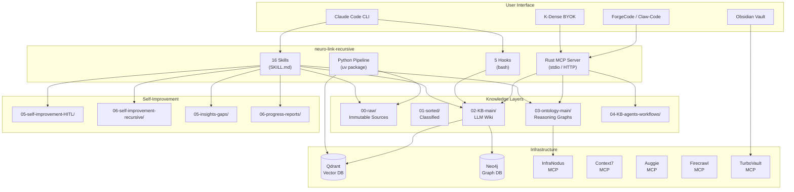
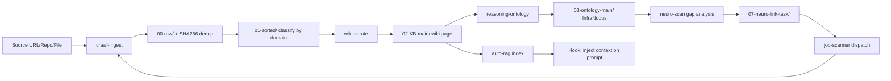
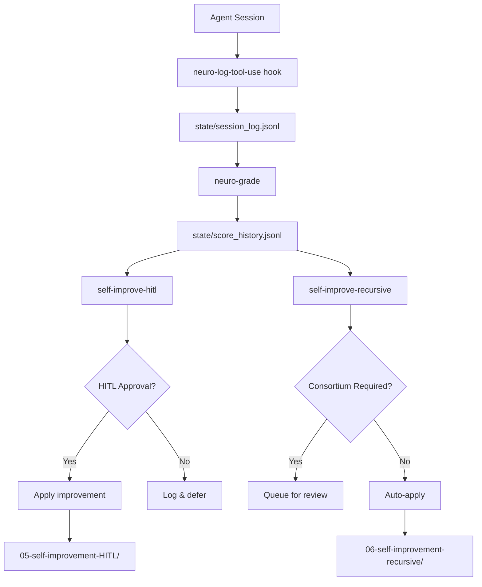
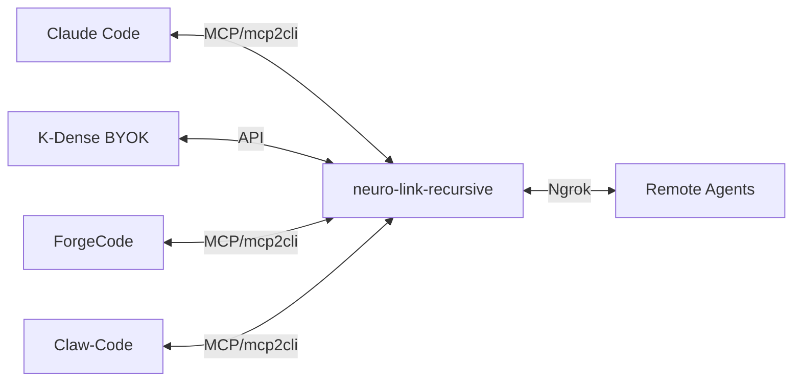

# neuro-link-recursive

Unified context, memory & behavior control plane for AI agent harnesses.

A hybrid RAG + LLM-Wiki system with a Rust MCP server core and Python helper pipeline. Drop markdown files to define workflows, reasoning ontologies, and operational tasks — the system auto-generates skills, hooks, cron jobs, and monitors performance.

## What It Does

- **LLM-Wiki** — Incrementally builds a persistent, cross-referenced wiki from raw sources (Karpathy pattern)
- **Auto-RAG** — Injects relevant wiki context into every prompt via hooks
- **Reasoning Ontologies** — Domain, agent, and workflow ontologies via InfraNodus
- **HITL + Recursive Self-Improvement** — Logs, grades, and improves agent performance
- **Harness Bridge** — Bridges Claude Code, K-Dense, ForgeCode via MCP
- **Markdown-First Config** — Drop `.md` files to define jobs, harness connections, workflows

## Architecture



## Data Flow



## Self-Improvement Loop



## Quick Start

```bash
# Clone
git clone https://github.com/HyperFrequency/neuro-link-recursive.git
cd neuro-link-recursive

# Initialize (creates dirs, installs skills/hooks, registers in settings.json)
bash scripts/init.sh

# Configure secrets
cp secrets/.env.example secrets/.env
# Edit secrets/.env with your API keys

# Install Python helpers
cd python && uv sync && cd ..

# Build Rust MCP server
cd server && cargo build --release && cd ..

# Interactive setup
/neuro-link-setup

# Check status
/neuro-link status
```

## Directory Layout

```
neuro-link-recursive/
├── server/                     Rust MCP server (cargo)
│   └── src/                    MCP tools: wiki, RAG, ontology, tasks, harness
├── python/                     Python helpers (uv package)
│   └── src/neuro_link_recursive/
│       ├── cli.py              CLI entry point
│       ├── embed.py            Qdrant embedding pipeline
│       ├── crawl.py            Single-URL ingestion
│       ├── parallel_crawl.py   Parallel async crawling
│       ├── grade.py            Session/wiki grading
│       ├── heartbeat.py        Health check daemon
│       └── config.py           Config file parser
├── skills/                     16 SKILL.md files (Phase 1 + Phase 2)
├── hooks/                      5 hook scripts
├── config/                     10 markdown config files (YAML frontmatter)
├── 00-raw/                     Immutable ingested sources
├── 01-sorted/                  Classified by domain
│   ├── books/ arxiv/ medium/ huggingface/ github/ docs/
├── 02-KB-main/                 Synthesized wiki (LLM-maintained)
│   ├── schema.md               Wiki conventions
│   ├── index.md                Auto-generated navigation
│   └── log.md                  Mutation audit trail
├── 03-ontology-main/           Reasoning ontologies
│   ├── workflow/               State definitions, phase gating, goals
│   └── agents/                 By-agent, by-state, by-HITL
├── 04-KB-agents-workflows/     Per-agent/workflow knowledge
├── 05-self-improvement-HITL/   Human-in-the-loop improvement
│   ├── overview.md
│   ├── models/                 logs-raw.md, logs-graded.md, change-log.md
│   ├── hyperparameters/        ...
│   ├── prompts/                ...
│   ├── features/               ...
│   ├── code-changes/           ...
│   └── services-integrations/  ...
├── 05-insights-gaps/           Knowledge gap reports
├── 06-self-improvement-recursive/  Automated improvement
│   ├── overview.md
│   ├── harness-to-harness-comms/
│   ├── harness-cli/            Session logs, grading, auto-rag, agents, skills
│   ├── harness-editor/         ...
│   ├── harness-web/            ...
│   └── brain/                  ...
├── 06-progress-reports/        Daily/weekly/monthly synthesis
├── 07-neuro-link-task/         Task queue (markdown job specs)
├── 08-code-docs/               Code documentation
│   ├── my-repos/ common-tools/ my-forks/
├── 09-business-docs/           Non-code docs
├── state/                      Runtime state (JSON/JSONL)
├── secrets/                    API keys (.gitignored)
├── scripts/init.sh             One-command setup
├── CLAUDE.md                   Agent instructions
├── SETUP.md                    LLM-guided setup walkthrough
└── README.md                   This file
```

## Skills (16)

### Phase 1 — Core
| Skill | Purpose |
|-------|---------|
| `neuro-link` | Main orchestrator: status, scan, ingest, curate |
| `neuro-scan` | Brain scanner: pending tasks, stale pages, gaps, failures |
| `wiki-curate` | Karpathy synthesis: raw → wiki page |
| `crawl-ingest` | Source ingestion with SHA256 dedup |
| `auto-rag` | Context injection per prompt |
| `job-scanner` | Task queue processor |
| `reasoning-ontology` | InfraNodus dual ontologies |
| `neuro-link-setup` | Interactive guided setup |

### Phase 2 — Self-Improvement & Maintenance
| Skill | Purpose |
|-------|---------|
| `neuro-surgery` | Fix failures, HITL tasks, ontology inconsistencies |
| `hyper-sleep` | Background maintenance daemon |
| `self-improve-hitl` | Propose improvements with human approval |
| `self-improve-recursive` | Automated improvement with consortium |
| `progress-report` | Daily/weekly/monthly synthesis |
| `knowledge-gap` | InfraNodus gap analysis → auto-tasks |
| `code-docs` | Deepwiki-style code documentation |
| `harness-bridge` | Cross-harness work dispatch |

## Hooks (5)

| Hook | Event | Purpose |
|------|-------|---------|
| `auto-rag-inject.sh` | UserPromptSubmit | Inject wiki context into prompts |
| `neuro-task-check.sh` | UserPromptSubmit | Remind about priority-1 tasks |
| `neuro-log-tool-use.sh` | PostToolUse | Log tool metadata (no secrets) |
| `harness-bridge-check.sh` | PreToolUse | Suggest harness delegation |
| `neuro-grade.sh` | PostToolUse | Score tool effectiveness |

## Configuration

All config at `config/*.md`. Each file has YAML frontmatter for machine-readable settings.

| Config | Purpose |
|--------|---------|
| `neuro-link.md` | Master config: active skills, directories, LLM routing |
| `neuro-scan.md` | Scan targets, staleness thresholds, notifications |
| `neuro-surgery.md` | HITL approval matrix, fix categories |
| `hyper-sleep.md` | Background maintenance schedule |
| `crawl-ingest-update.md` | Ingestion sources (4 table types), extraction strategies |
| `main-codebase-tools.md` | Your repos → auto-index via Context7 + Auggie |
| `adjacent-tools-code-docs.md` | Upstream tools → keep docs updated |
| `forked-repos-with-changes.md` | Fork divergence tracking |
| `harness-harness-comms.md` | Harness bridge routing rules |
| `neuro-link-config.md` | System config: MCP servers, Ngrok, permissions, logging |

## Markdown-Driven Operations

Drop `.md` files into `07-neuro-link-task/` to create jobs:

```yaml
---
type: ingest | curate | scan | repair | report | ontology
status: pending
priority: 1-5
created: 2026-04-15
---
# Job: Ingest NautilusTrader v2.0 release notes
Source: https://github.com/nautechsystems/nautilus_trader/releases
Auto-curate: yes
```

The `job-scanner` skill processes these automatically. The `neuro-scan` skill creates remediation tasks here when it finds issues.

## Harness-to-Harness Communication



Configure in `config/harness-harness-comms.md`. Each harness gets routing rules for task delegation.

## Python CLI

```bash
# Status check
nlr status

# Ingest a URL
nlr ingest https://example.com/article

# Parallel crawl
nlr-parallel-crawl url1 url2 url3 --max-concurrent 10

# Embed wiki into Qdrant
nlr embed --recreate

# Semantic search
nlr search "market microstructure"

# Grade session
nlr grade --session --wiki
```

## License

MIT
