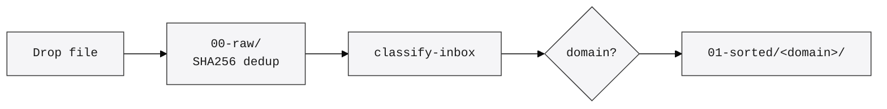
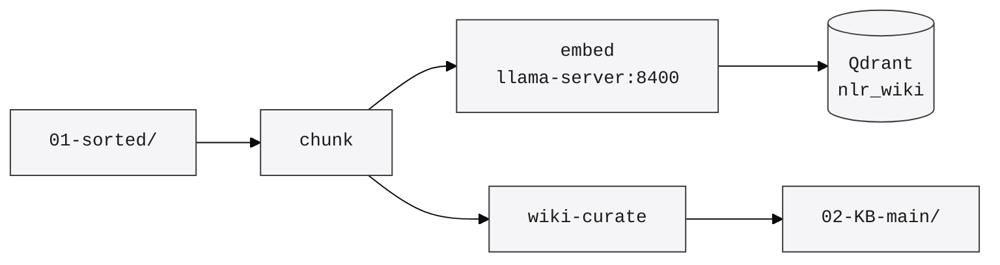
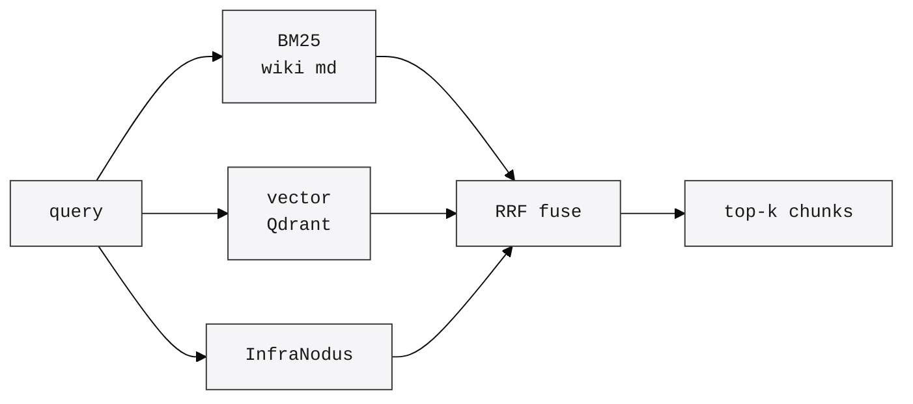
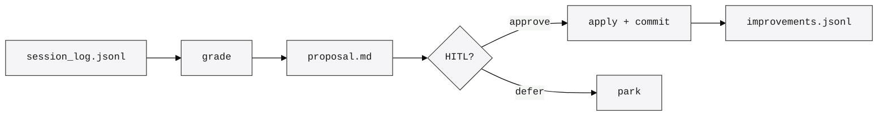

# neuro-link-recursive — Architecture

Four narrowly-scoped diagrams of the runtime. Each is small enough to read without zooming.

## 1. Drop → Classify

A file lands in `00-raw/` (from the inbox watcher, a CLI ingest call, or a hook) and is deduped by SHA256. The classifier reads its content, picks a domain (e.g. `software-engineering`, `trading`, `science`), and moves a symlink into `01-sorted/<domain>/`. Raw stays immutable.

## 2. Classify → Embed → Qdrant

Sorted sources are chunked (semantic + overlap), embedded with the local `llama-server` on :8400, and written to the Qdrant `nlr_wiki` collection with payload (domain, source_path, sha256). The wiki page synthesis step (Karpathy pattern) runs in parallel and writes markdown to `02-KB-main/`.

## 3. Query → Hybrid RAG

An agent calls `nlr_rag_query`. The server runs BM25 over wiki markdown, a vector search over Qdrant, and an optional external InfraNodus lookup — fused with Reciprocal Rank Fusion. Top-k chunks come back as MCP content.

## 4. Worker Loop → HITL

The background worker reads `state/session_log.jsonl`, grades tool calls, and emits a proposal markdown under `05-self-improvement-HITL/`. A human approves (or defers) via CLI; approved proposals are applied as a commit to source and a log entry in `state/improvements.jsonl`.

